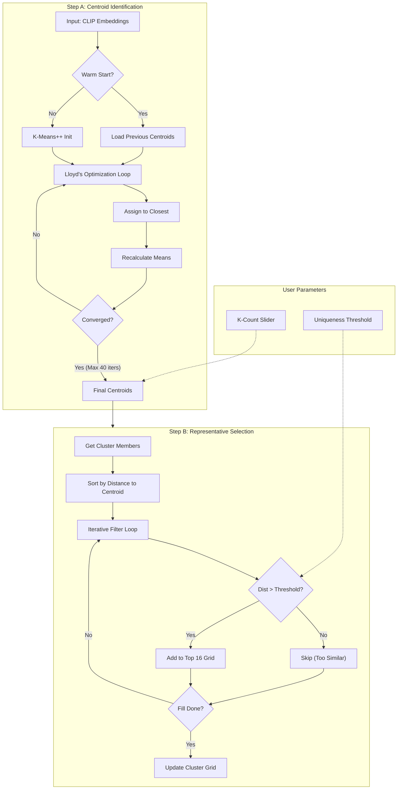

# Clustering Algorithm Deep-Dive

This document explains the mathematical and logical implementation of the image clustering engine in ClusterAI v2.

## Process Flow Diagram

PNG format image available for reference: [clustering_logic.png](clustering_logic.png)
---

##  Step A - Centroid Identification

The goal of this step is to find $k$ points (centroids) that minimize the total within-cluster variance. We use the **Cosine Distance** as our primary metric because CLIP embeddings are unit-length vectors where direction carries semantic meaning.

### 1. Distance Metric: Cosine Distance
For two embedding vectors $u$ and $v$, the distance $D_c$ is calculated as:
$$D_c(u, v) = 1 - \frac{u \cdot v}{\|u\| \|v\|}$$
*Note: Since standard CLIP embeddings are often normalized, $\|u\|=1$, reducing this to $1 - (u \cdot v)$.*

### 2. Initialization (Warm Start vs K-Means++)
*   **Warm Start**: If `previousCentroids` exist and $k$ hasn't changed, we seed the engine with the old positions. This ensures that "Cluster 1" remains "Cluster 1" even as new images are added.
*   **K-Means++**: If no history exists, we pick the first centroid randomly, and subsequent centroids are picked with probability proportional to their squared distance from existing centers. This prevents poor initial clusters.

### 3. Iterative Optimization (Lloyd's Algorithm)
We run up to **40 iterations** to reach convergence:
*   **Assignment**: Each image $x$ is assigned to cluster $S_i$ if:
    $$x \in S_i \iff D_c(x, C_i) \leq D_c(x, C_j) \text{ for all } j$$
*   **Update**: Centroid $C_i$ is moved to the mean of all its assigned members:
    $$C_{i}^{\text{new}} = \frac{1}{|S_i|} \sum_{x \in S_i} x$$

---

## Step B - Representative Selection (WYSIWYG)

Once clusters are formed, we need to pick 16 images to show the user. We don't just pick the "closest" 16, as they might be near-duplicates.

### 1. Proximity Sorting
We sort all members of a cluster $S_i$ by their distance to the centroid $C_i$ in ascending order. The "best" representative is the one closest to the mathematical center.

### 2. Deduplication Loop (Uniqueness Threshold)
We iterate through the sorted list and maintain a set of `selected_representatives`. For every new `candidate`, we check:
$$\min_{r \in \text{selected\_representatives}} D_c(\text{candidate}, r) > \text{Threshold}$$

*   **If True**: The candidate is sufficiently "different" from what is already being shown. It is added to the 16 slots.
*   **If False**: The candidate is too similar to an image already in the preview. It is skipped.

### 3. Parameters
*   **K (Count)**: Controls the granularity of the Step A loop.
*   **Uniqueness**: Directly sets the $\text{Threshold}$ in the Step B loop. Higher values force the UI to show a more diverse spread of images from the cluster.

---
