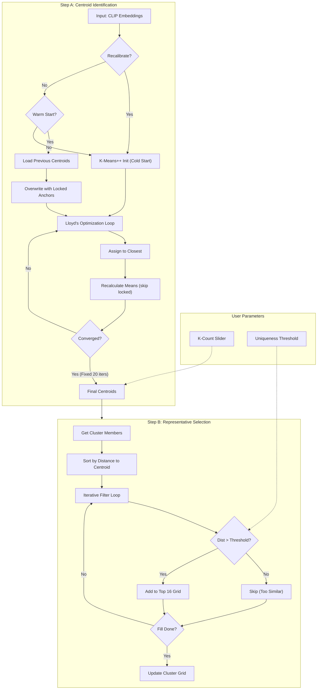
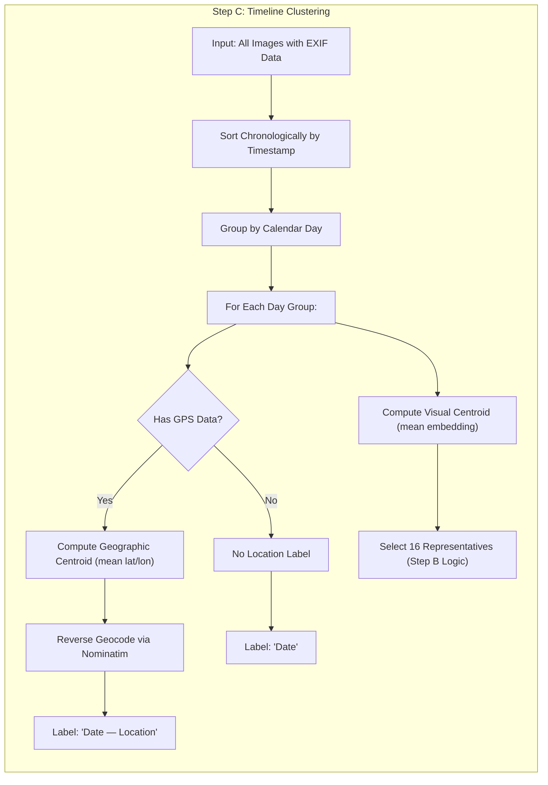

# Clustering Algorithm Deep-Dive

This document explains the mathematical and logical implementation of the image clustering engine in ClusterAI.

> **Note**: All embedding vectors are persisted in the browser's IndexedDB (via `db_manager.js`), enabling instant resume across sessions. The "Freeze/Lock" feature allows users to pin up to 6 clusters for structured export without affecting the clustering of remaining images.

## Process Flow Diagram


```mermaid
graph TD
    %% Global Parameters
    subgraph Params ["User Parameters"]
        direction LR
        K_VAL["K-Count Slider"]
        U_VAL["Uniqueness Threshold"]
    end

    %% Step A
    subgraph StepA ["Step A: Centroid Identification"]
        direction TB
        A1["Input: CLIP Embeddings"] --> A_RECAL{"Recalibrate?"}
        A_RECAL -- Yes --> A_KPLUS["K-Means++ Init (Cold Start)"]
        A_RECAL -- No --> A_INIT{"Warm Start?"}
        A_INIT -- Yes --> A_LOAD["Load Previous Centroids"]
        A_INIT -- No --> A_KPLUS
        
        A_LOAD --> A_ANCHOR["Overwrite with Locked Anchors"]
        A_ANCHOR --> A_LOOP["Lloyd's Optimization Loop"]
        A_KPLUS --> A_LOOP
        
        A_LOOP --> A_ASSIGN["Assign to Closest"]
        A_ASSIGN --> A_MEAN["Recalculate Means (skip locked)"]
        A_MEAN --> A_CONV{"Converged?"}
        A_CONV -- No --> A_LOOP
        A_CONV -- "Yes (Fixed 20 iters)" --> A_FINAL["Final Centroids"]
    end

    %% Step B
    subgraph StepB ["Step B: Representative Selection"]
        direction TB
        B1["Get Cluster Members"] --> B_SORT["Sort by Distance to Centroid"]
        B_SORT --> B_ITER["Iterative Filter Loop"]
        B_ITER --> B_DIST{"Dist > Threshold?"}
        B_DIST -- No --> B_SKIP["Skip (Too Similar)"]
        B_DIST -- Yes --> B_ADD["Add to Top 16 Grid"]
        
        B_SKIP --> B_CHECK{"Fill Done?"}
        B_ADD --> B_CHECK
        B_CHECK -- No --> B_ITER
        B_CHECK -- Yes --> B_UI["Update Cluster Grid"]
    end

    %% Connections
    K_VAL -.-> A_FINAL
    U_VAL -.-> B_DIST
    A_FINAL --> StepB
```
PNG format image available for reference: [clustering_logic.png](clustering_logic.png)
---

##  Step A - Centroid Identification

The goal of this step is to find $k$ points (centroids) that minimize the total within-cluster variance. We use the **Cosine Distance** as our primary metric because CLIP embeddings are unit-length vectors where direction carries semantic meaning.

### 1. Distance Metric: Cosine Distance
For two embedding vectors $u$ and $v$, the distance $D_c$ is calculated as:
$$D_c(u, v) = 1 - \frac{u \cdot v}{\|u\| \|v\|}$$
*Note: Since standard CLIP embeddings are often normalized, $\|u\|=1$, reducing this to $1 - (u \cdot v)$.*

### 2. Initialization: Warm Start, Recalibrate & K-Means++

There are three initialization paths:

*   **Partial Warm Start** (default): If $K$ doesn't change and no recalibration is requested, previous centroids are reused as seeds. This ensures "Box 1" remains "Box 1" even as new images arrive.
*   **Recalibrate (Cold Start)**: The user can press the ↺ button next to the Visual Clusters heading to force a full cold start. This clears `lastCentroids` entirely and re-seeds from scratch using K-Means++, allowing the algorithm to discover fundamentally different groupings.
*   **K-Means++ Expansion**: When $K$ increases beyond the number of existing centroids, current centroids are kept and K-Means++ seeds only the new slots by seeking the "loneliest" images in vector space.

#### Centroid Anchoring for Locked Clusters
After warm-start centroids are loaded, any locked cluster has its centroid **mathematically overwritten** with the stored anchor before the optimization loop begins. This identity overwrite is performed in `app.js` before the message is posted to the clustering Web Worker:

```js
// Identity Overwrite: Force warm start centroids to match locked anchors.
if (previousCentroids) {
    this.lockedClusters.forEach((data, key) => {
        if (key.startsWith('visual_')) {
            const idx = parseInt(key.replace('visual_', ''));
            if (idx < previousCentroids.length) {
                previousCentroids[idx] = [...data.centroid];
            }
        }
    });
}
```

### 3. Iterative Optimization (Discovery Loop)
We run exactly **20 iterations** per refresh. This provides the balance between stability and discovery:
*   **The Crawl**: Even if a center starts at a "Warm" location, it will "dash" toward new themes (like beach photos) over the 20 iterations until it is perfectly centered on new data.
*   **The Identity**: Because the starting point was "Cluster 1," the final result remains "Cluster 1," preserving the UI's identity mapping.
*   **Assignment**: Each image $x$ is assigned to cluster $S_i$ if:
    $$x \in S_i \iff D_c(x, C_i) \leq D_c(x, C_j) \text{ for all } j$$
*   **Update (Frozen vs. Fluid)**: For unlocked clusters, the centroid moves to the mean of its members:
    $$C_{i}^{\text{new}} = \frac{1}{|S_i|} \sum_{x \in S_i} x$$
    For **locked** clusters, this step is **skipped** — the centroid remains frozen at its anchor, acting as a fixed beacon in vector space. Images continue to be assigned to it based on proximity, but it never drifts.

### 4. Off-Thread Execution (Clustering Worker)
The K-Means pass runs entirely inside a **Web Worker** (`clustering_worker.js` → `clustering_engine.js`) to keep the main UI thread responsive. The main thread (`app.js`) serializes the embeddings, previous centroids, and locked indices, posts a message to the worker, and awaits the result before updating the UI.

---

## Step B - Representative Selection (WYSIWYG)

Once clusters are formed, we need to pick 16 images to show the user. We don't just pick the "closest" 16, as they might be near-duplicates.

### 1. Proximity Sorting
We sort all members of a cluster $S_i$ by their distance to the centroid $C_i$ in ascending order. The "best" representative is the one closest to the mathematical center.

### 2. Deduplication Loop (Uniqueness Threshold)
We iterate through the sorted list and maintain a set of `selected_representatives`. For every new `candidate`, we check:
$$\min_{r \in \text{selected\_representatives}} D_c(\text{candidate}, r) > \text{Threshold}$$

*   **If True**: The candidate is sufficiently "different" from what is already being shown. It is added to the 16 slots.
*   **If False**: The candidate is too similar to an image already in the preview. It is skipped.

### 3. Parameters
*   **K (Count)**: Controls the granularity of the Step A loop.
*   **Uniqueness**: Directly sets the $\text{Threshold}$ in the Step B loop. Higher values force the UI to show a more diverse spread of images from the cluster.

---

## Step C - Timeline & Location Clustering (Metadata Mode)

In addition to the visual (CLIP-based) clustering above, ClusterAI runs a **second, independent clustering pass** based on image metadata. This produces the "Timeline Clusters" section in the UI.

> Unlike Steps A–B which use AI embeddings, Step C uses **EXIF metadata** extracted from each image file (date taken, GPS coordinates). This means two images can end up in the same Timeline cluster even if they look completely different visually — they just need to have been taken on the same day.


```mermaid
graph TD
    subgraph StepC ["Step C: Timeline Clustering"]
        direction TB
        C1["Input: All Images with EXIF Data"] --> C_SORT["Sort Chronologically by Timestamp"]
        C_SORT --> C_GROUP["Group by Calendar Day"]
        C_GROUP --> C_DAY["For Each Day Group:"]
        C_DAY --> C_CENTROID["Compute Visual Centroid (mean embedding)"]
        C_DAY --> C_GPS{"Has GPS Data?"}
        C_GPS -- Yes --> C_GEO["Compute Geographic Centroid (mean lat/lon)"]
        C_GPS -- No --> C_NOGEO["No Location Label"]
        C_GEO --> C_REVERSE["Reverse Geocode via Nominatim"]
        C_REVERSE --> C_LABEL["Label: 'Date — Location'"]
        C_NOGEO --> C_LABEL2["Label: 'Date'"]
        C_CENTROID --> C_REPS["Select 16 Representatives (Step B Logic)"]
    end
```

### 1. EXIF Metadata Extraction

During the embedding phase (Step 1 of the pipeline), each image is also parsed for EXIF data using the [exifr](https://github.com/nicklaus-dev/exifr) library:

*   **`DateTimeOriginal`**: The timestamp when the photo was taken. Used as primary grouping key.
*   **`latitude` / `longitude`**: GPS coordinates, if available. Used for location labeling.
*   **Fallback**: If no EXIF date is found, the file's `lastModified` timestamp is used instead.

### 2. Date-Based Grouping

All images are sorted chronologically and then grouped by **calendar day** (local time):

$$\text{dateKey}(x) = \text{YYYY-MM-DD}(\text{timestamp}(x))$$

Each unique `dateKey` becomes one Timeline cluster. The cluster label is formatted as a human-readable date string (e.g., "Mar 15, 2026").

### 3. Geographic Centroid & Reverse Geocoding

For each day-group, if any images contain GPS data:

$$\bar{\text{lat}} = \frac{1}{n_{\text{gps}}} \sum_{i=1}^{n_{\text{gps}}} \text{lat}_i, \quad \bar{\text{lon}} = \frac{1}{n_{\text{gps}}} \sum_{i=1}^{n_{\text{gps}}} \text{lon}_i$$

The geographic centroid $(\bar{\text{lat}}, \bar{\text{lon}})$ is sent to the **OpenStreetMap Nominatim API** for reverse geocoding at city/town resolution (zoom level 12). Results are cached (rounded to 2 decimal places, ~1.1km precision) to minimize API calls. Rate-limiting is enforced with a 1.2s delay between requests.

The resolved location name (e.g., "Mumbai, Maharashtra") is appended to the cluster label.

### 4. Representative Selection

Each Timeline cluster reuses the **same deduplication logic from Step B**: a visual centroid is computed from the group's CLIP embeddings, and the 16 most representative (yet diverse) images are selected using the Uniqueness Threshold.

> [!IMPORTANT]
> **Centroid Drift & Thumbnail Shifting**: As new images are added to a day-group during processing, the "Visual Centroid" (the average theme) of that day evolves. This can cause the rank-order of representatives to change significantly. While **Visual Clusters** use a "Warm Start" to stay stable, **Timeline Clusters** are purely data-driven and will "drift" until all images for that date have been processed.

### 5. Sorting

Timeline clusters are sorted by **member count** (largest first), mirroring the Visual Clusters behavior.

---
